# Prompt to Loop

> **¿Qué pasaría si el LLM no se detuviera después de su primera respuesta?**

**Prompt to Loop** es un proyecto educativo para explorar uno de los patrones fundamentales detrás de los sistemas de IA agénticos: **Looping**.

En una interacción tradicional con un LLM tenemos:

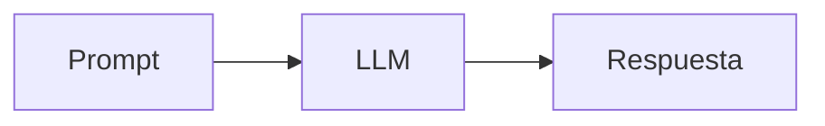

El modelo genera una respuesta y termina.

Pero **generar una respuesta no significa haber alcanzado el objetivo**.

Con Looping introducimos un mecanismo diferente:

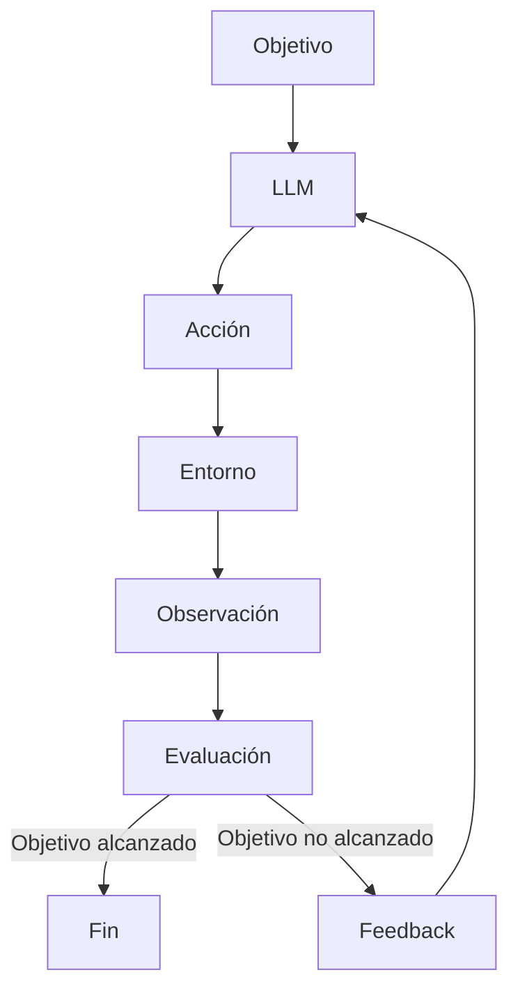

El sistema deja de depender exclusivamente de la primera respuesta del modelo y comienza a trabajar iterativamente hasta alcanzar un **criterio de éxito verificable**.

---

# ¿Por qué Looping?

Los LLM son buenos generando propuestas, pero una propuesta puede ser:

- incorrecta;
- incompleta;
- inválida;
- subóptima;
- imposible de ejecutar;
- aparentemente correcta, pero incapaz de cumplir el objetivo.

En el Prompting tradicional el flujo normalmente termina después de generar la respuesta:

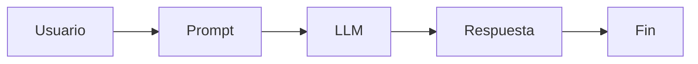

Looping introduce algo fundamental:

**evidencia sobre el resultado obtenido.**

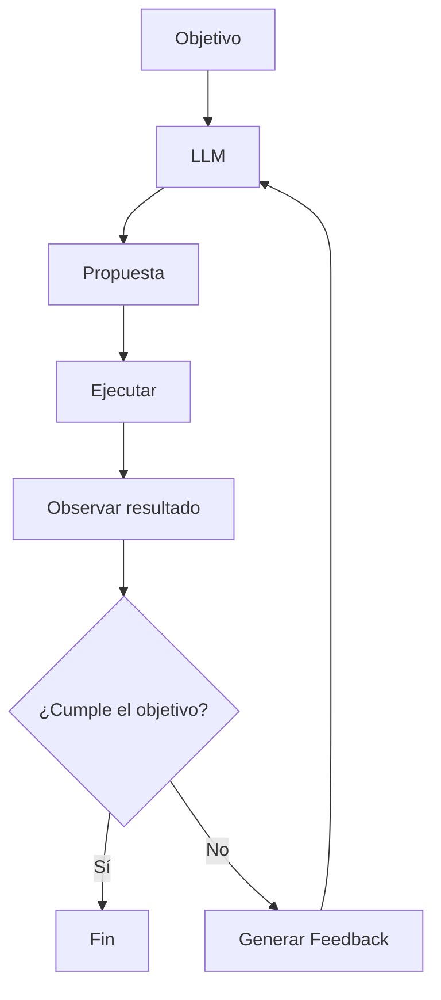

Ahora el sistema puede responder una pregunta mucho más importante:

> **¿La respuesta realmente consiguió el resultado esperado?**

Si la respuesta es `No`, puede utilizar lo observado para volver a intentarlo.

---

# Del Prompt al Objetivo

El cambio conceptual más importante de este proyecto es pasar de:

> "Genera una mejor solución."

a definir explícitamente:

```text
Objetivo:
Alcanzar X resultado.

Restricciones:
- debe ser válido;
- debe preservar determinadas condiciones;
- debe superar una métrica definida.

Condición de salida:
terminar cuando se alcance el objetivo
o cuando se llegue al máximo de intentos.
```

Esto introduce varios elementos fundamentales:

| Concepto | Responsabilidad |
|---|---|
| **Objetivo (Goal)** | Define qué queremos conseguir |
| **Acción (Action)** | Intenta conseguir el objetivo |
| **Observación (Observation)** | Obtiene evidencia del resultado |
| **Evaluación (Evaluation)** | Determina si el intento fue exitoso |
| **Feedback** | Alimenta el siguiente intento |

El ciclo empieza a tomar esta forma:

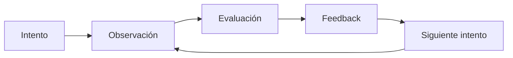

Repetir un prompt varias veces no es necesariamente Looping.

El valor aparece cuando **el resultado de un intento modifica inteligentemente el siguiente**.

---

# La Demo

Para demostrar el patrón utilizamos un problema fácil de ejecutar y verificar:

> **Optimización de una consulta SQL.**

SQL funciona especialmente bien para esta demostración porque permite pasar de una afirmación subjetiva:

> "Esta query parece mejor."

a evidencia objetiva:

```text
¿La query ejecuta?             ✓ / ✗
¿Devuelve el mismo resultado?  ✓ / ✗
¿Mejora el rendimiento?        ✓ / ✗
¿Alcanzó el objetivo?          ✓ / ✗
```

Por ejemplo:

```python
TARGET_IMPROVEMENT = 0.10
MAX_ITERATIONS = 5
```

Esto establece:

- mejora objetivo: **10 %**;
- máximo de intentos: **5**.

---

# Caso de uso

La demo utiliza un escenario simplificado de **tarjetas de crédito**.

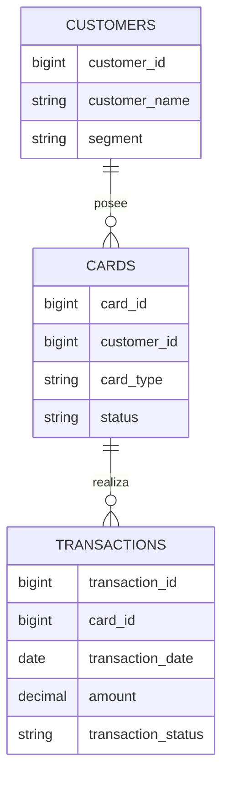

El dataset sintético contiene aproximadamente:

| Tabla | Registros |
|---|---:|
| Customers | 100K |
| Cards | 150K |
| Transactions | 20M |

La consulta busca responder:

> **¿Cuáles son los clientes Premium con mayor consumo aprobado durante 2025, considerando transacciones superiores al importe promedio del año?**

La consulta inicial funciona correctamente, pero contiene oportunidades de optimización.

---

# 1. Prompting

Primero ejecutamos el enfoque tradicional.

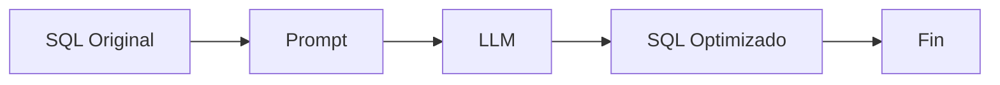

Le pedimos al modelo:

> Optimiza esta consulta SQL.

El modelo genera una nueva consulta.

El problema es que el proceso termina ahí.

El modelo puede afirmar que optimizó la query sin demostrar que:

- sea válida;
- produzca el mismo resultado;
- sea realmente más rápida.

Una respuesta convincente **no es necesariamente una solución correcta**.

---

# 2. Looping

Ahora agregamos ejecución, observación, evaluación y feedback.

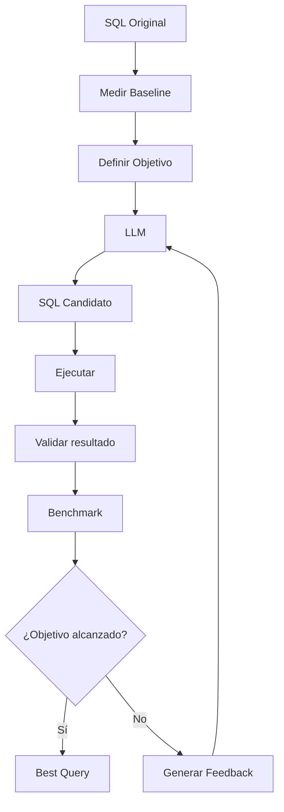

Cada iteración sigue el mismo patrón:

```text
Proponer
   ↓
Ejecutar
   ↓
Validar
   ↓
Medir
   ↓
Evaluar
   ↓
Feedback
   ↓
Reintentar
```

El LLM ya no decide por sí mismo si tuvo éxito.

**El entorno proporciona evidencia y el sistema evalúa esa evidencia.**

---

# Cuando el primer intento no es suficiente

Supongamos que obtenemos:

```text
ITERATION 1

Time        : 241 ms
Improvement : 1.61%
Same result : True
```

La consulta funciona y mantiene el resultado.

Pero nuestro objetivo era:

```text
Improvement >= 10%
```

Por lo tanto:

```text
1.61% < 10%

GOAL NOT ACHIEVED
```

El sistema no termina.

Genera feedback y realiza otro intento.

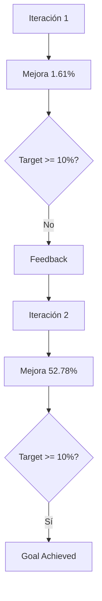

Una segunda iteración podría producir:

```text
ITERATION 2

Time        : 116 ms
Improvement : 52.78%
Same result : True

GOAL ACHIEVED
```

El porcentaje concreto no es lo importante y puede variar según hardware, modelo y condiciones de ejecución.

Lo importante es el comportamiento:

> **El sistema observó que su primer intento no cumplía el objetivo y utilizó esa información para continuar trabajando.**

---

# Los errores también son información

Un LLM puede generar SQL inválido.

Por ejemplo:

```text
Binder Error:
Referenced table not found
```

En una interacción tradicional:

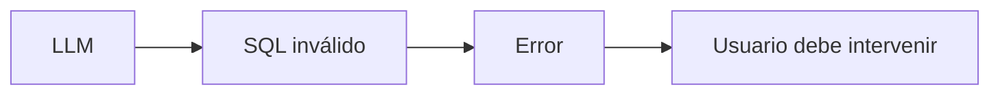

Dentro de un Loop:

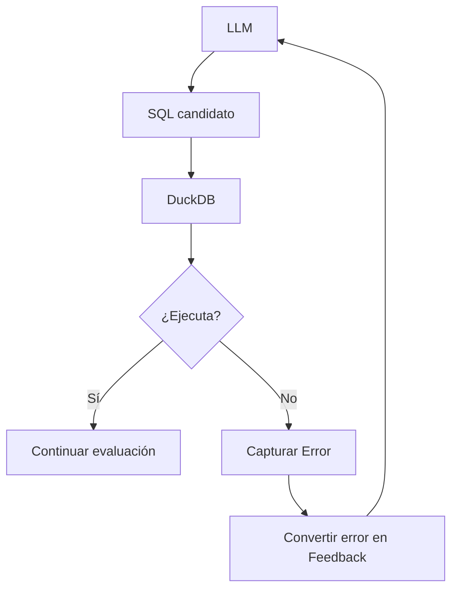

El error deja de ser únicamente un fallo.

Se convierte en una **observación que puede utilizarse para mejorar el siguiente intento**.

---

# El Loop en Python

Esta primera versión implementa deliberadamente el patrón sin frameworks de agentes.

Conceptualmente:

```python
while not goal_achieved:

    action = llm(...)

    observation = execute(action)

    evaluation = evaluate(observation)

    feedback = build_feedback(evaluation)
```

La implementación real incorpora además:

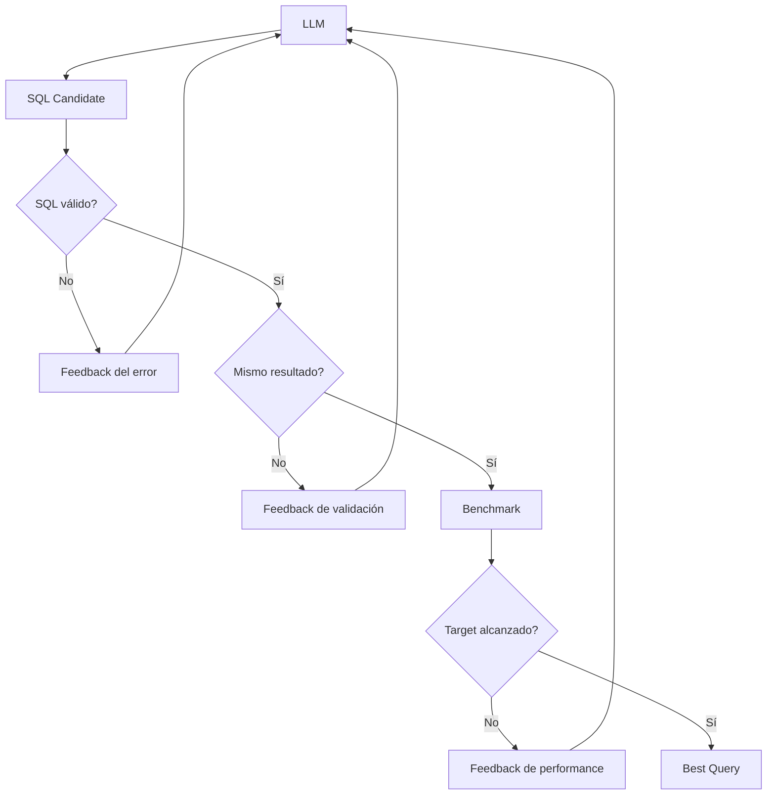

Esto permite ver directamente los componentes que posteriormente aparecerán en arquitecturas agénticas más sofisticadas.

---

# ¿Esto ya es un agente?

Esta demo se mantiene deliberadamente simple.

Tenemos:

```text
Goal
Action
Observation
Evaluation
Feedback
Loop
Stop Condition
```

Pero todavía no tenemos capacidades como:

```text
State Management
Tools
Dynamic Routing
Memory
Checkpoints
Human Approval
Observability
Multiple Actions
```

Cuando empezamos a agregar estas capacidades, nuestro simple `while` comienza a convertirse en un pequeño **Agent Runtime**.

Ahí frameworks especializados empiezan a aportar valor.

---

# Evolución del proyecto

El proyecto está diseñado en tres niveles.

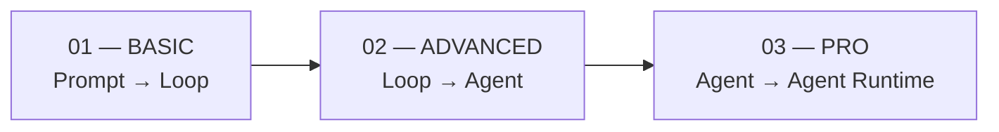

## Basic

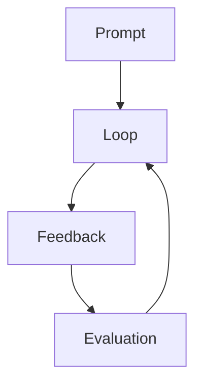

Objetivo:

> Entender **Looping** sin esconder su funcionamiento detrás de un framework.

---

## Advanced

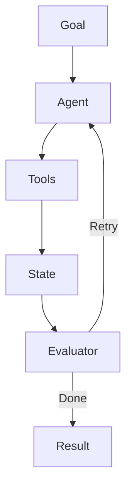

Incorporaremos:

- State;
- Tools;
- PostgreSQL;
- `EXPLAIN ANALYZE`;
- execution plans;
- estimated cost;
- scans;
- cardinalidad;
- índices.

Objetivo:

> Entender qué convierte un simple loop en un **agente**.

---

## Pro

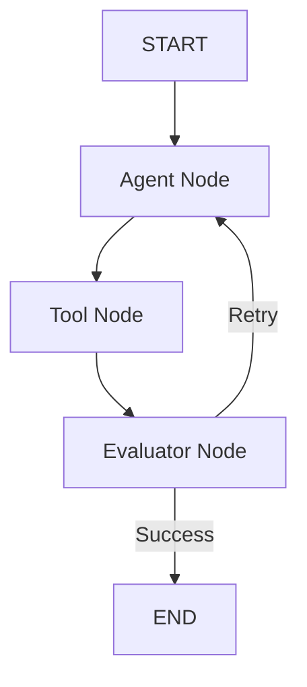

Introduciremos **LangGraph** para estructurar:

- State;
- Nodes;
- Edges;
- Conditional Routing;
- Checkpoints;
- Guardrails;
- Human-in-the-loop;
- observabilidad.

Objetivo:

> Entender por qué necesitamos un **Agent Runtime** cuando el loop empieza a crecer.

---

# Stack del Basic

La versión actual utiliza:

- Python
- Jupyter Notebook
- DuckDB
- Ollama
- Mistral
- OpenAI Python SDK

La arquitectura es completamente local:

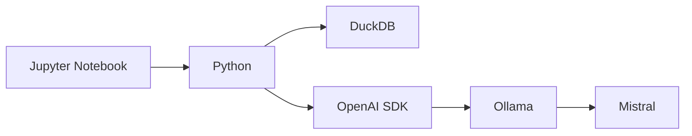

Ollama expone el modelo local mediante una API compatible con OpenAI.

Esto permite mantener una interfaz conocida:

```python
from openai import OpenAI
```

sin depender de un servicio cloud para ejecutar la demo.

---

# Más allá de SQL

SQL es solamente el primer laboratorio.

El patrón puede aplicarse a muchos otros problemas.

| Dominio | Loop |
|---|---|
| Código | Generate → Test → Error → Fix |
| Datos | Transform → Validate → Quality Check → Retry |
| Infraestructura | Generate → Validate → Policy Check → Fix |
| Testing | Generate → Execute → Observe → Improve |
| Seguridad | Analyze → Detect → Remediate → Verify |
| Research | Search → Evaluate → Identify Gaps → Search Again |

Todos comparten una estructura similar:

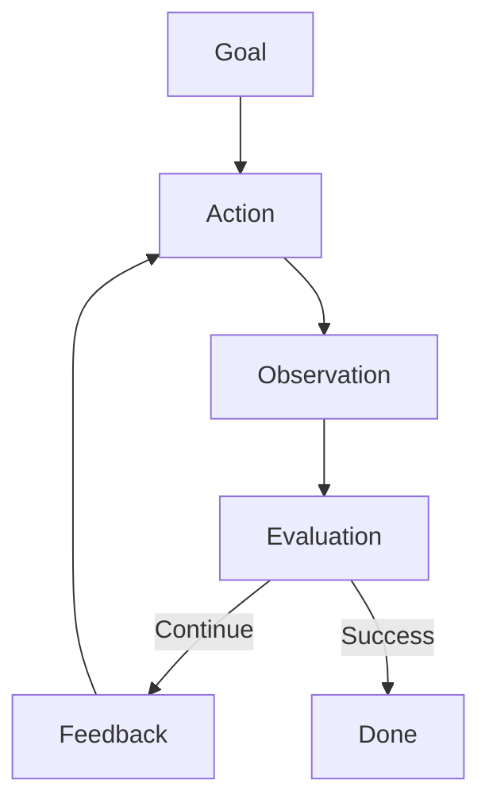

Ese patrón es la razón de ser de **Prompt to Loop**.

---

# Principio del proyecto

> **No le pidas simplemente al modelo una mejor respuesta.**
>
> **Dale al sistema un objetivo, una forma de medir su progreso y la capacidad de volver a intentarlo.**

---

# Ejecutar el Basic

La implementación actual se encuentra en:

```text
01-basic/
```

Consulta:

```text
01-basic/README.md
```

para las instrucciones de instalación y ejecución.

El flujo completo de la demo es:

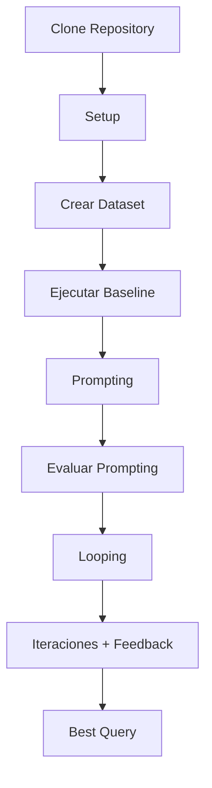

---

# Seguridad y limitaciones

Este proyecto tiene fines educativos.

Permitir que un LLM ejecute acciones introduce riesgos adicionales. En sistemas productivos deben considerarse, entre otros:

- principio de mínimo privilegio;
- sandboxing;
- validación de acciones;
- límites de iteraciones;
- timeouts;
- observabilidad;
- auditoría;
- control de costos;
- Human-in-the-Loop;
- rollback;
- políticas y guardrails.

> **Looping aumenta la autonomía del sistema. También aumenta la necesidad de gobernarlo.**

---

# Licencia

Este proyecto se distribuye bajo la licencia **MIT**.